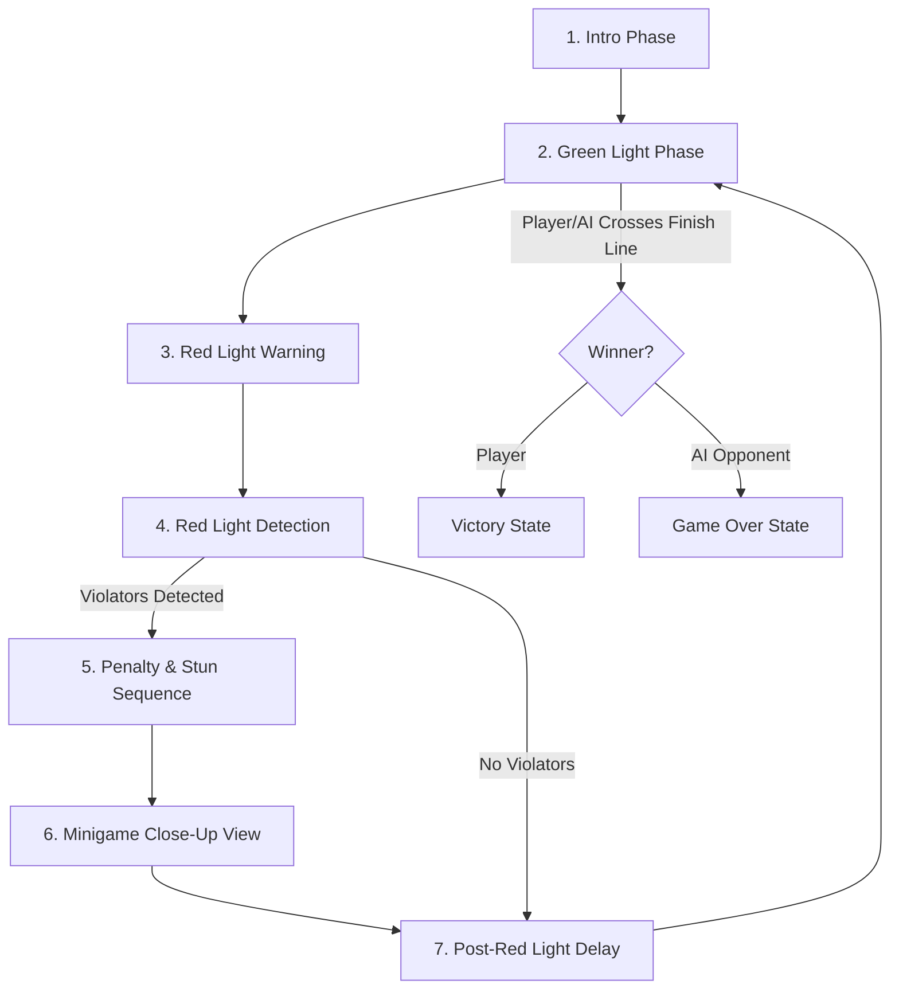
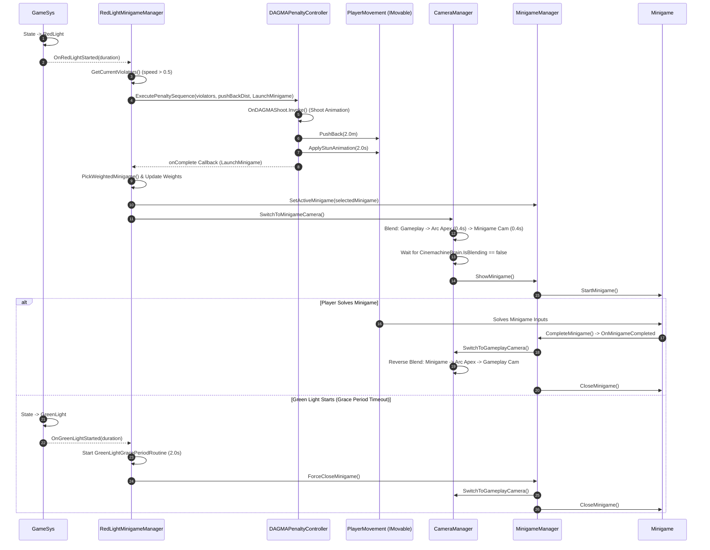
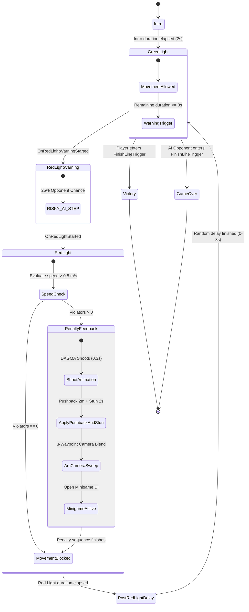
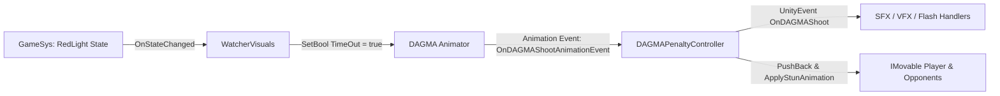

# GMTKGJ --- DAGMA: Complete Systems Architecture & Documentation

> [!NOTE]
> **Project Context:** GMTKGJ --- DAGMA  
> **Engine Version:** Unity 6000.3.20f1  
> **Target Scene:** `Assets/Scenes/WorkingProto.unity`  

---

## 1. High-Level Overview

**GMTKGJ --- DAGMA** is a momentum-based survival racing game centered around a high-stakes "Red Light / Green Light" game loop monitored by **DAGMA**, a watcher entity. Players compete against AI opponents to reach the finish line first while completing frantic 2D minigames when caught moving during Red Light phases.



### Core Gameplay Loops & Systems

1. **Red Light / Green Light State Machine (`GameSys`)**
   - **Intro Phase:** Initial countdown (2s) where movement is locked.
   - **Green Light Phase:** Random duration ($4.0\text{s} - 10.0\text{s}$). All movers (`IMovable`) can build momentum and move forward.
   - **Red Light Warning Phase:** The final $3.0\text{s}$ (`warningDuration`) of Green Light signals an impending turn. AI opponents have a chance to take risky steps during this window.
   - **Red Light Phase:** Random duration ($4.0\text{s} - 8.0\text{s}$). Speed checks evaluate any mover exceeding `speedThreshold` ($0.5\text{ m/s}$). Movement for all entities is locked for the remaining duration.
   - **Post-Red Light Delay:** Random pause ($0.0\text{s} - 3.0\text{s}$) before transitioning back to Green Light.

2. **Player Momentum Movement (`PlayerMovement`)**
   - **Alternating Key Input:** Players build momentum by rapidly tapping alternate left (`Q`) and right (`E`) keys.
   - **Speed Scaling & Friction:** Successful alternating taps add speed (`accelerationPerTap` = 3.0) up to `maxSpeed` ($15.0\text{ m/s}$). Speed naturally decays over time (`deceleration` = 4.0/s).
   - **Mistake Penalty:** Pressing the same key consecutively incurs a speed penalty (`wrongTapPenalty` = 1.0).
   - **UI Feedback:** Speed is visualized in real-time on a HUD scrollbar slider (`speedScrollbar`).

3. **AI Opponent System (`OpponentMovement`)**
   - **Rhythm-Based Stepping:** AI opponents emulate stepping by scheduling alternating steps within a random interval ($0.2\text{s} - 0.5\text{s}$).
   - **Risky Behavior & Reaction Times:** During `RedLightWarning`, opponents have a 25% chance (`riskyWarningStepChance`) to execute a risky step after a reaction delay ($0.1\text{s} - 0.6\text{s}$), occasionally getting caught by DAGMA.

4. **DAGMA Watcher Entity (`WatcherVisuals` & `DAGMAPenaltyController`)**
   - **Visual State Sync (`WatcherVisuals`):** Syncs DAGMA's eyes animation parameter (`TimeOut`) and signal eye indicator renderer material (Green during Green Light, Red during Red Light).
   - **Penalty Execution (`DAGMAPenaltyController`):** When caught moving, DAGMA fires a shoot animation/event, applies a physical pushback force ($2.0\text{m}$ backwards), and triggers a stun animation delay ($2.0\text{s}$) on violators.

5. **2D Minigame Suite & Pool Management (`RedLightMinigameManager`, `MinigameManager`, `Minigame`)**
   - **Weighted Random Pool:** Selects minigames based on dynamic weightings. To prevent repetition, a played minigame's weight drops to 0.1, while unselected minigames recover +0.25 weight per round.
   - **Camera Transition Sweep:** Smoothly transitions camera via a 3-waypoint Cinemachine arc sweep (Gameplay $\rightarrow$ Over-The-Shoulder Apex $\rightarrow$ Minigame Front View).
   - **Green Light Grace Period:** If Green Light starts while a player is still solving a minigame, a grace period timer ($2.0\text{s}$) starts. If time expires, the minigame is force-closed with a status message "Better luck next time!".
   - **Minigame Types:**
     - **Cleaning Minigame (`CleaningMinigame`):** Scrub away $3-7$ procedural dirt splats (`DirtSplat`) using mouse movements, featuring a custom wipe cursor and squeaky audio SFX.
     - **Keypad Minigame (`KeypadMinigame`):** Solve microwave riddle codes (e.g., "Quick! Call the Police!" $\rightarrow$ 911) across multiple solves using a 12-button keypad grid.
     - **Temperature Minigame (`TemperatureMinigame`):** Time a moving temperature slider bar into a sweet spot target zone ($65\% - 80\%$) before it reaches maximum to prevent burning/freezing food.

---

## 2. Detailed System Interactions

### Event Architecture & Class Relationships

The codebase uses a decoupled architecture powered by C# delegates/events and Singleton managers:

| System Component | Interacts With | Interaction Mechanism | Purpose |
| :--- | :--- | :--- | :--- |
| `GameSys` | `IMovable`, `WatcherVisuals`, `GameUI`, `RedLightMinigameManager` | C# Events (`OnStateChanged`, `OnRedLightStarted`, `OnGreenLightStarted`, `OnPenaltyFeedbackStarted`, etc.) | Central game state machine controller. |
| `DAGMAPenaltyController` | `IMovable` (`PlayerMovement`, `OpponentMovement`) | Direct Calls (`PushBack()`, `ApplyStunAnimation()`) | Handles shoot timing, knockback, and stun delays. |
| `RedLightMinigameManager` | `GameSys`, `DAGMAPenaltyController`, `CameraManager`, `MinigameManager` | Event Subscriptions & Direct Singleton Calls | Listens for Red/Green state transitions, triggers penalty sequence, picks minigames, and handles grace periods. |
| `CameraManager` | `CinemachineBrain`, `CinemachineCamera`, `MinigameManager` | Direct Calls & Priority Manipulation | Drives waypoint arc sweep blends and signals `MinigameManager.ShowMinigame()` when blending finishes. |
| `MinigameManager` | `Minigame`, `CameraManager` | C# Event (`OnMinigameCompleted`) & Direct Calls | Controls open/close UI states for active minigames and returns to gameplay view upon success. |
| `WatcherVisuals` | `GameSys`, `Animator`, `Renderer` | Event Listener (`OnStateChanged`) | Controls DAGMA visual indicators (eyes open/closed animation, green/red signal material). |
| `FinishLineTrigger` | `GameSys`, `IMovable` | Physics Trigger (`OnTriggerEnter`) | Identifies winning entity and reports victory/game over to `GameSys`. |

---

### Sequence Diagram: Red Light Penalty & Minigame Workflow



---

### State Machine Flowchart



---

## 3. Hierarchy & Scene Structure (`WorkingProto.unity`)

Below is the scene structure of `WorkingProto.unity` and component bindings:

```
WorkingProto (Scene)
├── Directional Light
├── GameManager (GameObject)
│   ├── GameSys (Script)
│   ├── DAGMAPenaltyController (Script)
│   ├── RedLightMinigameManager (Script)
│   ├── MinigameManager (Script)
│   └── SoundManager (Script)
├── Cameras (GameObject)
│   ├── Main Camera (Camera, CinemachineBrain, AudioListener)
│   ├── CinemachineCamera_Gameplay (CinemachineCamera - Priority: 20)
│   ├── CinemachineCamera_ArcApex (CinemachineCamera - Priority: 5)
│   ├── CinemachineCamera_Minigame (CinemachineCamera - Priority: 5)
│   ├── CameraManager (Script)
│   └── PipCamera (Camera, PictureInPicture)
├── Track Environment (GameObject)
│   ├── Floor Track (MeshFilter, MeshRenderer, BoxCollider)
│   └── FinishLine (BoxCollider [Trigger], Rigidbody [Kinematic], FinishLineTrigger)
├── Watcher (GameObject - DAGMA Entity)
│   ├── WatcherVisuals (Script)
│   ├── Animator (Controller: WatcherAnimator, Parameter: TimeOut [Bool])
│   └── SignalRenderer (MeshRenderer - Eye Material Color)
├── Characters (GameObject)
│   ├── Char (Player - Active GameObject)
│   │   ├── PlayerMovement (Script, IMovable)
│   │   ├── CapsuleCollider / Rigidbody
│   │   └── Animator (Parameter: Stun [Trigger])
│   └── Opponent_01 (AI Opponent)
│       ├── OpponentMovement (Script, IMovable)
│       ├── CapsuleCollider / Rigidbody
│       └── Animator (Parameter: Stun [Trigger])
└── UI Canvas (Canvas, CanvasScaler, GraphicRaycaster)
    ├── GameUI (Script)
    ├── PhaseTimerText (TextMeshProUGUI)
    ├── StateText (TextMeshProUGUI)
    ├── YouMovedText (TextMeshProUGUI)
    ├── Speed Scrollbar (Scrollbar - Bound to PlayerMovement)
    ├── PipRawImage (RawImage - Bound to PictureInPicture)
    ├── MinigameContainer (GameObject)
    │   ├── CleaningMinigame (Script, Minigame)
    │   │   ├── DirtSpawnArea (RectTransform)
    │   │   ├── DirtPrefab (DirtSplat Prefab)
    │   │   └── SqueakAudioSource (AudioSource)
    │   ├── KeypadMinigame (Script, Minigame)
    │   │   ├── MicrowaveScreen (TargetText, OutputText)
    │   │   ├── ButtonGrid (Btn_0 through Btn_9, KeypadButton)
    │   │   └── ClearButton / TimeButton (KeypadButton)
    │   └── TemperatureMinigame (Script, Minigame)
    │       ├── TemperatureSlider (Slider)
    │       ├── MicrowaveDisplayImage (Image)
    │       ├── MinTargetLine / MaxTargetLine (RectTransform)
    │       └── DoorButton (Button - OnClick -> OnDoorButtonClicked)
    ├── ResultPanel (GameObject - Victory/GameOver UI)
    └── PausePanel (GameObject - Pause Menu UI)
```

### Key Inspector Bindings Summary

| GameObject | Component | Critical Inspector Fields |
| :--- | :--- | :--- |
| `GameManager` | `GameSys` | `greenLightDurationRange`: (4, 10), `warningDuration`: 3, `redLightDurationRange`: (4, 8), `speedThreshold`: 0.5, `pushBackDistance`: 2.0 |
| `GameManager` | `RedLightMinigameManager` | `minigamePool`: [CleaningMinigame, KeypadMinigame, TemperatureMinigame], `selectedWeightDrop`: 0.1, `weightRecoveryPerRound`: 0.25, `gracePeriodDuration`: 2.0 |
| `GameManager` | `DAGMAPenaltyController` | `stunDelay`: 2.0, `shootAnimationDuration`: 0.3, `OnDAGMAShoot`: (UnityEvent listeners) |
| `Cameras` | `CameraManager` | `gameplayCamera`: CinemachineCamera_Gameplay, `arcApexCamera`: CinemachineCamera_ArcApex, `minigameCamera`: CinemachineCamera_Minigame, `stepDuration`: 0.4 |
| `Char` | `PlayerMovement` | `leftKey`: Q, `rightKey`: E, `accelerationPerTap`: 3.0, `maxSpeed`: 15.0, `deceleration`: 4.0, `speedScrollbar`: Speed Scrollbar |
| `Watcher` | `WatcherVisuals` | `animator`: Watcher Animator, `signalRenderer`: Eye MeshRenderer, `greenColor`: Green, `redColor`: Red |

---

## 4. Extensibility Guide

### A. How to Add New Minigames

1. **Create a new C# class inheriting from `Minigame`:**

```csharp
using UnityEngine;

public class WireCuttingMinigame : Minigame
{
    public override void StartMinigame()
    {
        base.StartMinigame(); // Sets IsCompleted = false & gameObject.SetActive(true)
        // Reset minigame puzzle state here
    }

    public override void CloseMinigame()
    {
        base.CloseMinigame(); // Sets gameObject.SetActive(false)
        // Clean up temporary objects/listeners
    }

    public void OnWireCut(bool isCorrectWire)
    {
        if (isCorrectWire)
        {
            CompleteMinigame(); // Base method: marks complete & fires OnMinigameCompleted event
        }
        else
        {
            FailMinigame(); // Base method: fires OnMinigameFailed event
        }
    }
}
```

2. **Add Minigame UI Panel to Hierarchy:**
   - Create your UI layout as a child of `MinigameContainer` under `UI Canvas`.
   - Attach your `WireCuttingMinigame` component to the panel root.

3. **Register in `RedLightMinigameManager`:**
   - Select `GameManager` in the Inspector.
   - In `RedLightMinigameManager`, add your new minigame object to the `minigamePool` list with an initial `currentWeight` of `1.0`.

> [!TIP]
> Minigames automatically participate in the continuous weighting system ($0.1$ drop after play, $+0.25$ recovery per round), ensuring balanced rotation without code changes.

---

### B. How to Adjust Stun, Speed, and Grace Parameters

All balancing parameters are exposed directly in the Inspector:

* **Stun Duration:** Adjust `DAGMAPenaltyController -> Stun Delay` (Default: `2.0s`). This controls how long violators remain stunned before the camera transition and minigame launch.
* **DAGMA Shoot Animation Timing:** Adjust `DAGMAPenaltyController -> Shoot Animation Duration` (Default: `0.3s`).
* **Green Light Grace Period:** Adjust `RedLightMinigameManager -> Grace Period Duration` (Default: `2.0s`). This specifies how much extra time a player receives to complete an active minigame once Green Light starts.
* **Red Light Speed Violation Sensitivity:** Adjust `GameSys -> Speed Threshold` (Default: `0.5 m/s`). Lower values make detection stricter; higher values allow slight creeping.
* **Knockback Distance:** Adjust `GameSys -> Push Back Distance` (Default: `2.0m`).

> [!IMPORTANT]
> When `PlayerMovement.ApplyStunAnimation(duration)` is triggered, the player cannot move even if `GameSys` transitions back to `GreenLight` until `stunDelay` expires.

---

### C. How to Hook Up New DAGMA 3D Models & Animators

1. **Animator Parameters:**
   - Ensure the new DAGMA Animator Controller contains a **Boolean parameter** named `TimeOut`.
   - `WatcherVisuals` automatically sets `TimeOut = true` when Red Light starts and `TimeOut = false` when Green Light starts.

2. **Animation Event Hookup for Shooting:**
   - On the new DAGMA 3D model's shoot animation clip, add an **Animation Event** at the exact frame where the shot fires.
   - Set the function name to: `OnDAGMAShootAnimationEvent`.
   - Attach `DAGMAPenaltyController` to the GameObject or bind `OnDAGMAShootAnimationEvent()` to trigger `DAGMAPenaltyController.Instance.OnDAGMAShoot`.

3. **Signal Light Renderer:**
   - Assign the eye/signal mesh component to `WatcherVisuals -> Signal Renderer`.
   - `WatcherVisuals` will automatically tint the material color red/green upon phase changes.


